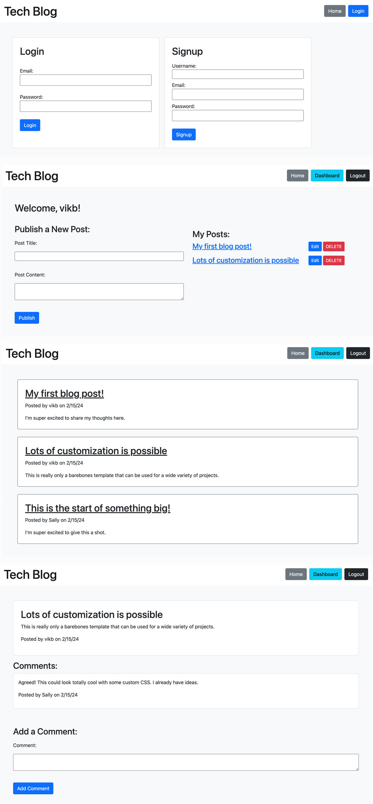

# Tech Blog

## Project Description

This project serves as a perfect starting template for a full stack web application, with backend routes for CRUD, frontend dynamic views, user authentication and sessions, and a database.

It uses NodeJS for the backend, Express for the server routes, Express Handlebars and Express Session for the views and session storage, Sequelize for the ORM, MySQL for the database, Dotenv for secrets, and Bcrypt for password hashing.

There's also custom middleware to handle date timestamps, user authentication, and ensuring that only logged in post authors can see Edit/Delete options.

The blog uses Bootstrap for a wireframe starter style, but custom CSS can take this template to whatever project you can dream of.

## Installation

Fork, install dependencies, customize the Models, Routes, and Views to your heart's content. Use the schema to initialize your database, and run 'npm run seed' to seed the database with users, posts, and comments for testing.

